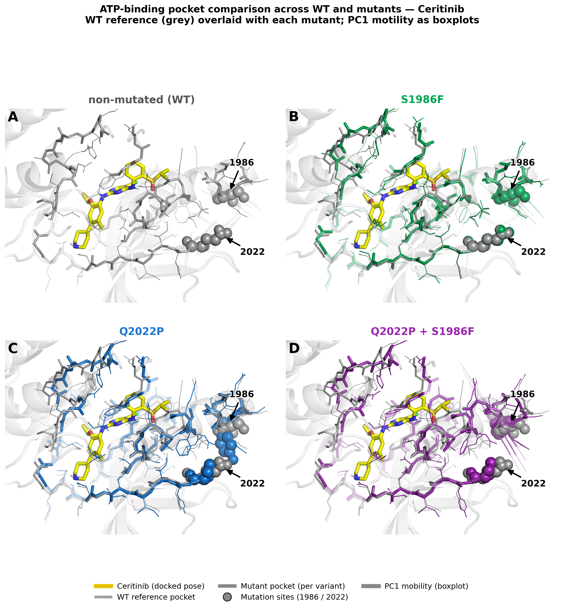
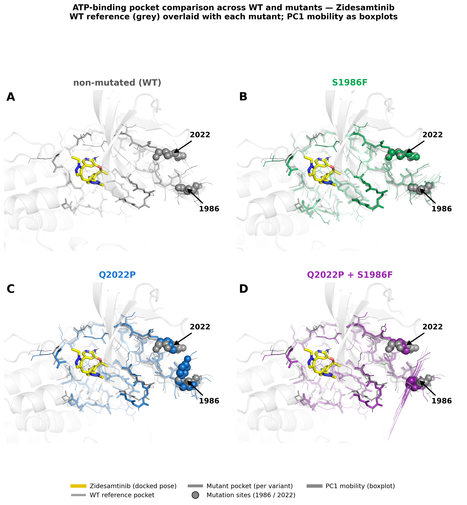
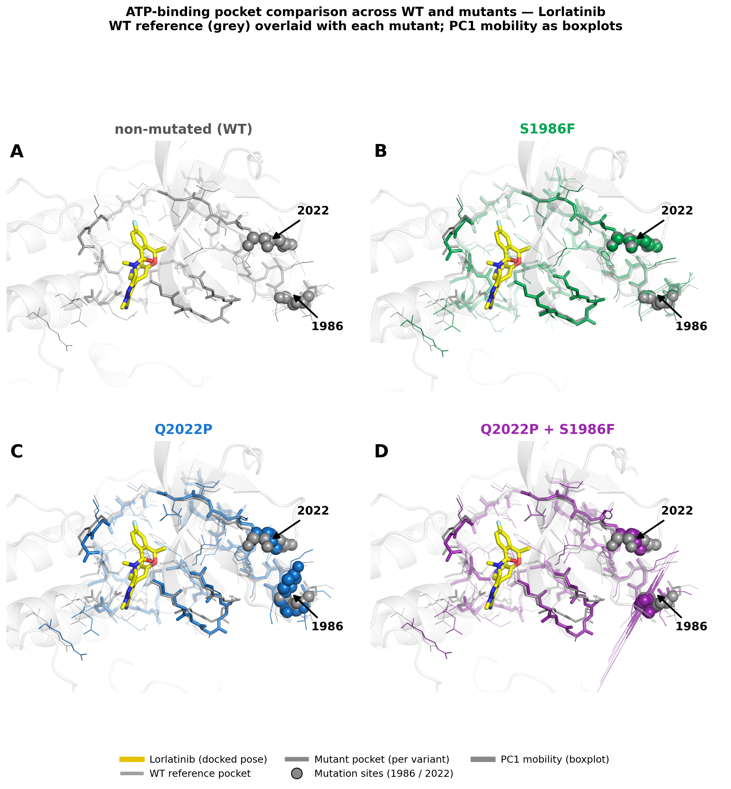
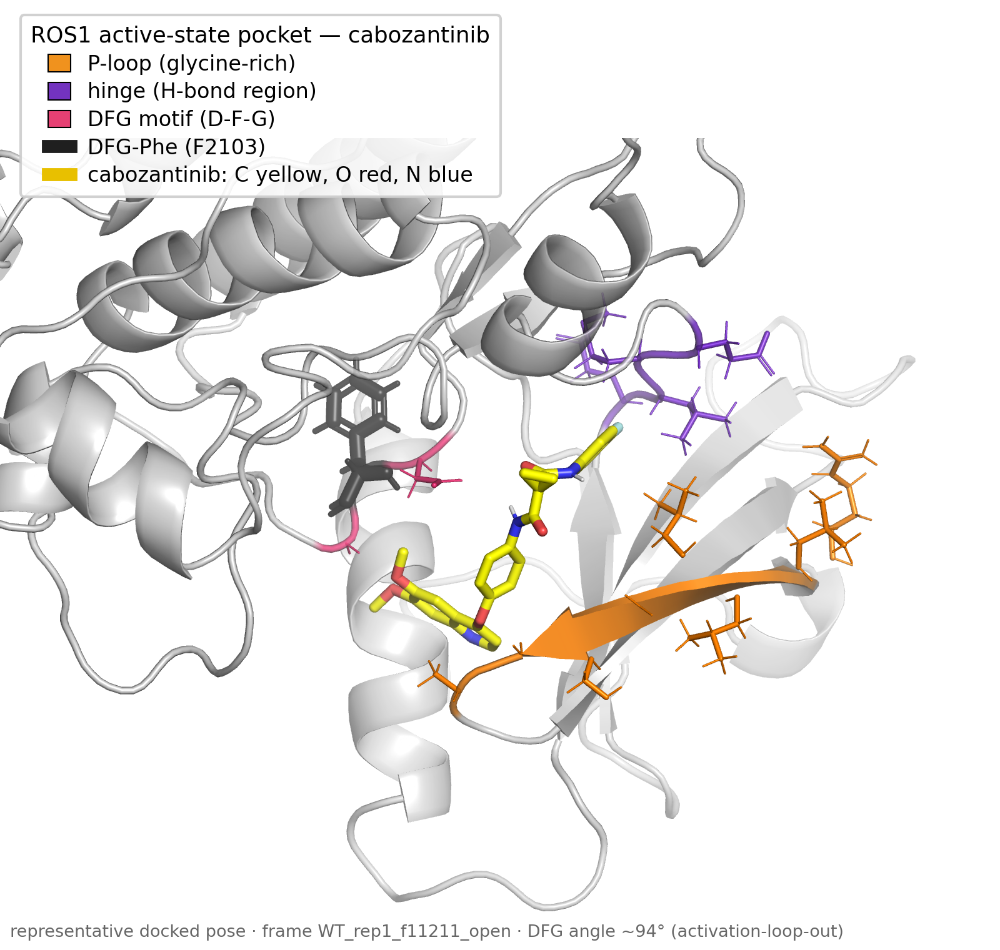
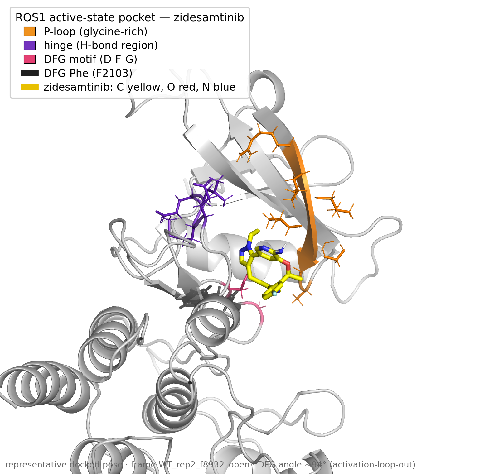
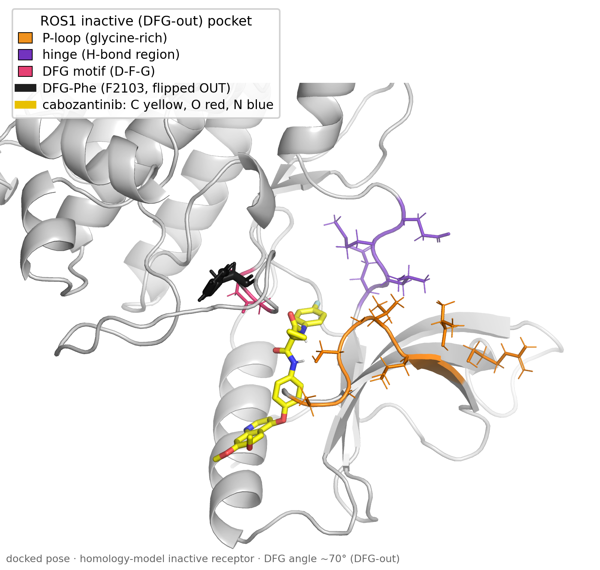

# ROS1 Kinase Resistance Mutations — Conformational Landscape & Drug-Binding Analysis

**Lily Konadu Gyammerah**
MSc Data Science for Life Sciences, Hanze University of Applied Sciences
Supervisor: Tsjerk A. Wassenaar (Hanze / University of Groningen)

---

## Overview

This repository contains the molecular dynamics (MD) and docking analysis behind an
MSc thesis on **how resistance mutations reshape the conformational landscape of the
ROS1 kinase domain**, and what that means for tyrosine-kinase-inhibitor (TKI) binding
in ROS1 fusion-positive non-small-cell lung cancer (NSCLC).

The core study (the graded thesis) is a **panel-wide analysis of 38 clinically
documented ROS1 kinase-domain resistance mutations plus wild-type** — 39 systems,
simulated in triplicate — using multi-subspace principal component analysis (PCA),
free-energy-landscape (FEL) analysis, density-based clustering, linear discriminant
analysis (LDA), and ensemble docking.

An **ongoing publication extension** (manuscript in preparation, with C. Dijkhuizen
and T. Wassenaar) narrows to four clinically important variants and adds a deeper,
carefully validated docking and binding-mode analysis across six TKIs. Sections
belonging to that extension are marked accordingly.

> **Scope at a glance**
> - **Thesis (complete, graded):** 39 systems · conformational landscape · PCA / FEL / clustering / LDA · exploratory docking (crizotinib, lorlatinib).
> - **Publication extension (in progress):** 4 focal variants · 6 TKIs · MD-ensemble docking · binding-mode / DFG-state analysis · active vs inactive states.

For dependencies, environment, and script-by-script execution order, see
[METHODS.md](METHODS.md).

---

## Analysis pipeline


---

## Dataset

38 clinically documented ROS1 kinase-domain resistance mutations plus wild-type
(**39 systems**), each simulated with **3 independent replicas** (117 simulations,
targeting 500 ns per replica; ~62 µs aggregate). Starting structures were generated
with **AlphaFold2** from the UniProt canonical sequence of human ROS1
(P08922, kinase-domain residues 1934–2225). Simulations used the **AMBER99SB-ILDN**
force field, **TIP3P** water, and **GROMACS 2024.5**.

*F1994L was excluded from the comparative analysis:* AlphaFold2 predicted it in a
distinct inactive-like conformation not comparable to the rest of the panel.

Trajectory files (~62 µs) are too large to version here; the computed analysis
outputs needed to reproduce the figures are provided under `results/` (see
[Reproducibility](#reproducibility)).

---

## Key findings (thesis)

**Q2022P produces a population-shift resistance mechanism.** Proline substitution at
the hinge reduces ATP-pocket open-state occupancy from 81 % (WT) to 65 %, without
substantially reducing crizotinib affinity in the open state. Resistance arises from
reduced conformational accessibility, not reduced affinity.

**S1986F and S1986Y act as conformational suppressors.** In compound mutations with
Q2022P, both partially compensate the Q2022P-induced shift through distinct structural
routes traced to a single chemical difference (a para-hydroxyl group). LDA separates
all three compound systems from WT with replica-level separation
(Cohen's *d*: −0.748, −0.464, −0.792).

**Amino-acid identity, not position, determines conformational outcome.**
Same-position contrast pairs (L1982F vs L1982V, S1986F vs S1986Y, G2032K vs G2032R,
F2004C/V/L) show strong chemical specificity at individual resistance hotspots.

**C-lobe helices are the primary discriminator between WT and Q2022P.** LDA structural
projection identifies C-lobe redistribution — not N-lobe ATP-pocket change — as the
dominant signal, consistent with strain propagation through the regulatory spine from
the hinge to the C-lobe helix bundle.

**The 38 variants are not conformationally equivalent.** DBSCAN noise fractions range
from 0.08 % (D2113N) to 7.27 % (L1982V); negative-control natural variants are
distinguishable from clinical resistance mutations across all analysis spaces.

---

## Publication extension — docking & binding-mode analysis *(in progress)*

The thesis established the conformational landscape. The manuscript extension asks how
that landscape translates into **drug binding**, for four focal variants
(**WT, S1986F, Q2022P, Q2022P + S1986F**) across six TKIs
(**cabozantinib, ceritinib, crizotinib, lorlatinib, repotrectinib, zidesamtinib**).

**Ensemble docking.** Rather than dock into a single structure, each drug is docked
into a per-variant ensemble of MD frames (open and closed pocket states), so scores
reflect the conformational distribution rather than one snapshot.

**Methodological rigor (ligand preparation).** During the extension, three
ligand-preparation artifacts in the earlier exploratory docking were identified and
corrected: a macrocyclic ligand that had been docked as a flat, rigid ring
(inflating its score); one mislabelled ligand structure (verified and replaced by
molecular formula against PubChem); and 2D ligand inputs re-embedded as 3D conformers.
All ligands were re-docked from verified 3D structures. **These corrections do not
change the conformational conclusions; they make the docking trustworthy.**

**Binding-mode / state analysis.** Contact analysis places both featured drugs at the
hinge (Glu2027 / Met2029). Cabozantinib additionally engages the inactive **DFG-out**
state (type II); zidesamtinib is a hinge-binding, ATP-competitive (type I) inhibitor.
DFG-state and αC-helix geometry were validated against a published ROS1 reference
(Vilachã et al., 2025), and receptor provenance and state caveats are documented
alongside the figures.

The honesty caveats apply throughout: Vina scores are not IC₅₀; the active-state
receptors are activation-loop-out models; and the inactive structure is a single
validated DFG-out conformation.

---

## Key figures (publication extension)

**Pocket geometry across variants.** Per-residue ATP-pocket distances for each variant,
with the docked inhibitor shown for spatial reference.





**Binding-mode and state analysis.** Active- and inactive-state (DFG-out) binding poses
for the two featured TKIs.





---

## Interactive dashboard

An interactive **Streamlit** dashboard explores the conformational results — per-mutant
FEL exploration, Q2022P-family comparison, docking results, and a panel-wide metrics
heatmap across all 39 systems:

```bash
streamlit run analysis/dashboard.py
```

It reads pipeline outputs from `results/` and falls back to representative demo data
when run outside the cluster, so it is explorable on any machine.

---

## Reproducibility

```bash
python -m venv ros1_analysis_env
source ros1_analysis_env/bin/activate
pip install -r requirements.txt
```

Structural rendering additionally uses system **Open-Source PyMOL 3.1.0** (not a pip
package; see [METHODS.md](METHODS.md)). Analysis scripts are run from the repository
root in numbered order; the full pipeline, script descriptions, and tool versions are
in [METHODS.md](METHODS.md). `ROS1_MDAnalysis_Notebook.ipynb` reproduces the main
figures interactively once `results/` is populated.

---

## Repository structure

```
analysis/
  01_*                      Trajectory loading, alignment, masking
  02a–02f_*                 PCA subspaces, clustering, transitions
  03a–03c_*                 Structural metrics, distance PCA, free-energy landscapes
  04–04c_*                  Linear discriminant analysis
  05a–05c_*                 Thesis docking (Q2022P family): prep, run, ranking
  06*_*                     Publication extension: 6-TKI ensemble docking,
                            active/inactive states, pocket & binding-mode figures
  dashboard.py              Interactive Streamlit dashboard
  scripts/                  Shared library + figure/render tooling
                            (PCA, clustering, DFG-state checks, pocket & binding renders)
docs/                       Pipeline flowchart and supporting documentation
figures/                    Curated figures
results/                    Computed outputs (PCA scores, cluster labels, metrics, docking tables)
dock/                       Docking inputs, receptors, ligands, Vina configs & outputs
ROS1_MDAnalysis_Notebook.ipynb
METHODS.md                  Reproducibility guide — dependencies, pipeline, script order
requirements.txt            Python dependencies (pinned)
```

---

## Limitations & future work

The analysis scripts are largely procedural — logic at module scope rather than
packaged functions — reflecting their origin as sequential research steps. A natural
next step is to refactor shared logic into importable, testable modules and to split
the exploratory notebook into focused topic notebooks. On the science side, the
docking scores are Vina affinities (not free energies or experimental IC₅₀), and the
active-state receptors are AlphaFold-derived; quantitative binding claims are framed
accordingly.

---

## Reference

Vilachã, J. F., Ul-Haq, Z., et al. (2025). *ACS Omega* 10, 22837–22846.
https://doi.org/10.1021/acsomega.5c00072 — the ROS1 active/inactive conformational
reference against which DFG-state geometry was validated.
