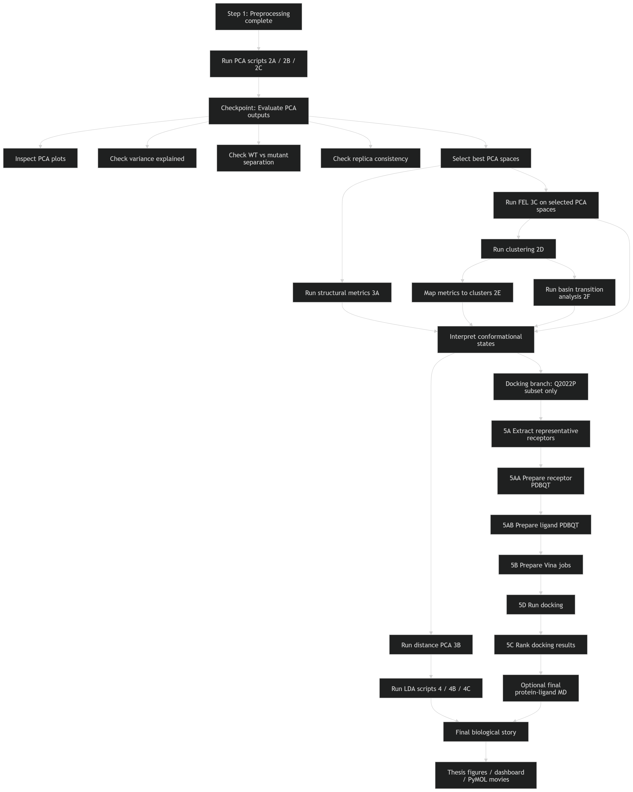

# ROS1 Kinase Mutant Molecular Dynamics Analysis

**Lily Konadu Gyammerah**
MSc Data Science for Life Sciences, Hanze University of Applied Sciences
Supervisor: Tsjerk Wassenaar

---

## Overview

This repository contains the analysis code and results for a systematic, panel-wide molecular dynamics (MD) study of 38 ROS1 kinase domain resistance mutations associated with tyrosine kinase inhibitor (TKI) resistance in ROS1 fusion-positive non-small-cell lung cancer (NSCLC).

The study applies multi-scale principal component analysis (PCA) across four structural subspaces, free energy landscape (FEL) analysis, density-based clustering, linear discriminant analysis (LDA), and ensemble docking to characterise how individual resistance mutations reshape the conformational landscape of the ROS1 kinase domain — and what that means for drug binding.

For full reproducibility details, dependencies, and script execution order, see [METHODS.md](METHODS.md).

---

## Analysis Pipeline



---

## Dataset

38 clinically documented ROS1 kinase domain resistance mutations plus wild-type (39 systems), simulated with 3 independent replicas each (117 simulations total), targeting 500 ns per replica (~62 µs aggregate). Starting structures were generated with AlphaFold2 from the UniProt canonical sequence of human ROS1 (P08922, residues 1934–2225). Simulations used the AMBER99SB-ILDN force field, TIP3P water model, and GROMACS 2024.5.

F1994L was excluded from comparative analysis: AlphaFold2 predicted this variant in a distinct inactive conformation not comparable to the rest of the panel.

---

## Key Findings

**Q2022P produces a population-shift resistance mechanism.** Proline substitution at the hinge (ROS1 2022) reduces ATP pocket open-state occupancy from 81% (WT) to 65%, without substantially reducing crizotinib binding affinity in the open state (−8.463 vs −8.644 kcal/mol). Resistance arises from reduced conformational accessibility, not reduced affinity. Q2022P paradoxically increases lorlatinib affinity (−8.224 vs −7.200 kcal/mol), consistent with the compact conformation being more complementary to lorlatinib's macrocyclic scaffold.

**S1986F and S1986Y act as conformational suppressors.** In compound mutations with Q2022P, both secondary mutations partially compensate the Q2022P-induced conformational shift through distinct structural mechanisms driven by the single chemical difference of a para-hydroxyl group. LDA separates all three compound systems from WT with perfect replica-level separation (Cohen's d: −0.748, −0.464, −0.792).

**Amino acid identity, not position, determines conformational outcome.** Same-position contrast pairs (L1982F vs L1982V, S1986F vs S1986Y, G2032K vs G2032R, F2004C/V/L) demonstrate strong chemical specificity at individual resistance hotspots.

**C-lobe helices are the primary conformational discriminators between WT and Q2022P.** LDA structural projection identifies C-lobe redistribution — not N-lobe ATP pocket changes — as the dominant signal, explained by strain propagation through the regulatory spine from the hinge kink to the C-lobe helix bundle.

**The 38 variants are not conformationally equivalent.** DBSCAN noise fractions range from 0.08% (D2113N) to 7.27% (L1982V). Negative control natural variants are distinguishable from clinical resistance mutations across all analysis spaces.

---

## Docking Results

AutoDock Vina v1.2.5 | Box: 25 × 20 × 20 Å centred on the ATP binding pocket | Exhaustiveness: 16

| System | Crizotinib (kcal/mol) | Lorlatinib (kcal/mol) |
|---|---|---|
| WT | −8.644 | −7.200 |
| Q2022P | −8.463 | −8.224 |
| Q2022P\_S1986F | −6.455 | −6.106 |
| Q2022P\_S1986Y | −5.508 | −6.369 |

---

## Interactive Dashboard

An interactive Streamlit dashboard is included for exploring the conformational analysis results. It covers per-mutant free energy landscape exploration, Q2022P family comparison, docking results, and a panel-wide metrics heatmap across all 39 systems. Run with:

```bash
streamlit run analysis/dashboard.py
```

The dashboard loads pipeline outputs directly from the results directory and falls back to representative demo data when run outside the cluster environment, making it suitable for interactive exploration on any machine.

---

## Repository Contents

```
analysis/                          Pipeline scripts (preprocessing through ensemble docking)
analysis/dashboard.py              Interactive Streamlit dashboard
analysis/scripts/                  Shared utilities including Princomp and Colorinator classes
docs/                              Pipeline flowchart and supporting documentation
figures/                           All generated figures
results/                           Computed outputs (PCA scores, cluster labels, metrics, docking results)
dock/                              Docking inputs, receptor and ligand PDBQTs, Vina configurations and outputs
ROS1_Analysis_Notebook_v9.ipynb    Final analysis notebook
METHODS.md                         Reproducibility guide — dependencies, pipeline, script order
REPORT.md                          Internal project record — confirmed results and status
requirements.txt                   Python package dependencies with pinned versions
```

---

## Project Extensions (Publication-Track Pipelines)

Beyond the core active-state analysis of five baseline FDA-approved inhibitors, this repository has been extended with advanced structural characterization, pocket volumetry, and inactive-state (DFG-out) docking pipelines to support an upcoming peer-reviewed manuscript.

### Key Pipeline Extensions:

* **Active-Site PCA & Conformation Violins** 
  * Characterizes active-site conformational spaces using Principal Component Analysis (`analysis/02b2_pca_activesite.py`, `analysis/scripts/pca.py`).
  * Generates publication-ready PCA projection overlays comparing variants (`analysis/plot_pca_overlay_paper.py`) and automates the rendering of PC1 conformational distribution violins directly inside PyMOL (`analysis/pymol_B_pc1_violin.py`).
* **DFG Conformation Quality Control & Target Selection**
  * Custom geometric engines (`analysis/check_dfg_angle.py`, `analysis/check_dfg_calibrate.py`, `analysis/check_dfg_state.py`) programmatically calculate crucial dihedral angles to verify active (DFG-in) vs. inactive (DFG-out) state orientations prior to docking.
  * Specialized script to select and extract representative receptor coordinate frames for the Q2022P mutant and associated family variants (`analysis/05a_select_extract_docking_receptors_q2022p.py`).
* **Cabozantinib Inactive-State (Type II) Docking Pipeline**
  * A fully automated pipeline (`analysis/run_inactive_pipeline.sh`) that orchestrates mutating inactive template structures (`analysis/06d_mutate_inactive_receptors.py`), preparing docking grids (`analysis/06e_prepare_inactive_mutants_dock.py`), running docking trials across states (`analysis/06a_prepare_cabozantinib_active.py`, `analysis/06b_prepare_cabozantinib_inactive.py`), and analyzing poses (`analysis/06c_rank_cabozantinib.py`, `analysis/06f_analyze_cabozantinib_poses.py`).
  * Yields high-resolution comparative figures detailing active vs. inactive binding affinity trends (`analysis/plot_cabozantinib_results.py`) and formats final docking summaries styled specifically for journal submission (`analysis/plot_docking_results_paper.py`).
* **Active-Site Pocket Volumetry & Image Composition**
  * Automated workflows (`make_volume.sh`, `make_pocket_figure.sh`, `make_overview.sh`) to measure active-site volume fluctuations across trajectory frames (`analysis/pocket_volume.py`), clean and prepare coordinate surfaces (`analysis/pocket_prep.py`, `analysis/pocket_lib.py`), and generate raw ray-traced image renders (`analysis/pocket_render.py`, `analysis/overview_render.py`).
  * Merges structural outputs and metric labels into polished multi-panel figures (`analysis/pocket_compose.py`, `analysis/overview_compose.py`, `analysis/pocket_panel.py`).