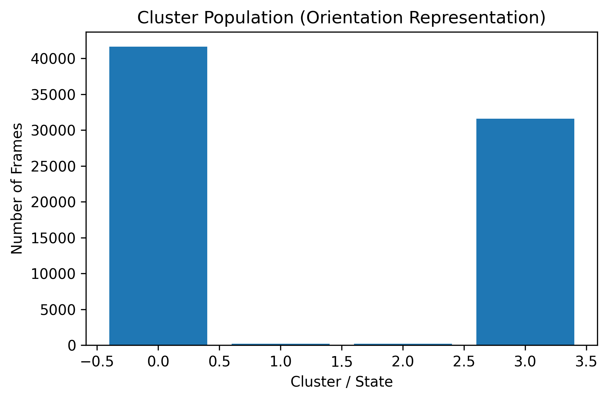

# ROS1 Kinase Mutant Molecular Dynamics Analysis

## Overview

This repository contains the molecular dynamics (MD) simulation pipeline and structural analysis for **ROS1 kinase domain mutants**. The goal of this project is to investigate how specific mutations affect the conformational dynamics of the ROS1 kinase domain and potentially influence inhibitor resistance.

The workflow includes the following stages:

- Structure generation using **AlphaFold**
- System preparation and **molecular dynamics simulations with GROMACS**
- Trajectory preprocessing and structural alignment
- Conformational analysis using **principal component analysis (PCA)**
- Density-based clustering of conformational states
- Structural visualization using **PyMOL**

Multiple replicas were simulated for each mutant to compare their conformational landscapes and identify differences in dominant motions.

---

## Studied System

Protein: **ROS1 kinase domain**

Residue range used for modeling:
**ROS1_HUMAN** (UniProt: P08922)  
Residues: 1934–2225

## Mutations Studied

A total of **39 ROS1 kinase variants** were analyzed, including single mutants, combined mutants, and the wild-type reference.

| Variant |
|--------|
| WT |
| C2060G |
| D1988N |
| D2033N |
| D2113G |
| D2113N |
| E1935G |
| E1990G |
| E2020K |
| E2131Q |
| F1994L |
| F2004C |
| F2004L |
| F2004V |
| F2075V |
| G1957A |
| G1971E |
| G2032K |
| G2032R |
| G2048A_NC |
| G2101A |
| H1999Q_NC |
| L1947R |
| L1951R |
| L1982F |
| L1982V |
| L2010M |
| L2026M |
| L2053V_NC |
| L2086F |
| L2155S |
| Q2022P |
| Q2022P_S1986F |
| Q2022P_S1986Y |
| R2078K |
| S1986F |
| S1986Y |
| V2089M |
| V2098I |

Replicate simulations were performed for each mutant to ensure reproducibility.

---

## Repository Structure

```
ROS1_MD_project/
│
├── structures/
│   AlphaFold-generated starting structures
│
├── md_setup/
│   GROMACS system preparation files
│   └── tpr files
│
├── trajectories/
│   MD trajectory files
│
├── analysis/
│   Python notebook and scripts for trajectory analysis
│
│   ├── MD_final_pipeline.ipynb
│   │   Complete structural analysis pipeline
│   │
│   ├── scripts/
│   │   Helper Python modules used by the analysis
│   │   ├── clustering.py
│   │   ├── occupancy.py
│   │   ├── plotting.py
│   │   └── timer.py
│   │
│   └── figures/
│       Generated figures from the analysis notebooks
│
├── pymol/
│   PyMOL scripts for structural visualization
│
└── README.md
```


---

## Simulation Workflow

### Structure Preparation

Initial structures of the ROS1 kinase domain were generated using **AlphaFold**.

Selected residue range:
1934–2225


Mutations were introduced into the structures before MD simulation.

---

### Molecular Dynamics Simulations

Simulations were performed using **GROMACS**.

Typical workflow:
```
pdb2gmx
editconf
solvate
grompp
genion
mdrun
```

Simulations were run in **multiple replicas** for each mutant to capture conformational variability.

---

### Trajectory Processing

Trajectory preprocessing included:

- Removing periodic boundary conditions
- Structural alignment
- Selection of relevant atoms (backbone: N, CA, C, O)

Flexible terminal regions were excluded from some analyses to avoid artifacts due to high mobility.

---

### Principal Component Analysis (PCA)

PCA was used to characterize the dominant conformational motions of the kinase domain.

Steps included:

1. Alignment of trajectories
2. Construction of a combined dataset across mutants
3. Covariance matrix calculation
4. Eigenvector decomposition
5. Projection of trajectories onto principal components

This allows comparison of the conformational space sampled by different mutants and helps identify mutation-dependent shifts in dominant structural motions.

---

## Structural Analyses Performed

To better understand mutation-dependent structural dynamics, several region-specific PCA analyses were performed on the ROS1 kinase domain.

### Global Kinase PCA (ACT-IN)

Principal component analysis was first performed on the backbone atoms of the full kinase domain including the activation loop.

This analysis captures the dominant global motions of the kinase and allows comparison of the conformational landscapes sampled by different mutants.

### Global Kinase PCA (ACT-OUT)

To reduce noise from the highly flexible activation loop, PCA was repeated after excluding activation loop residues.

This highlights global motions of the kinase core and allows clearer comparison of mutant-dependent conformational shifts.

### N-terminal Lobe PCA (NTL)

PCA was performed specifically on the N-terminal lobe of the kinase domain to isolate structural variability in this regulatory region.

This analysis helps detect mutation-induced changes in the dynamics of the kinase N-lobe.

### C-terminal Lobe PCA (CTL)

A separate PCA analysis was performed on the C-terminal lobe of the kinase domain, which forms the catalytic core of the kinase.

This allows comparison of structural stability and conformational variation within the catalytic lobe across mutants.

### Activation Loop PCA (A-loop)

The activation loop plays a key regulatory role in kinase activity. PCA was used to characterize its conformational flexibility and identify potential shifts in activation loop dynamics between mutants.

### Tyrosine Loop PCA (Tyr-loop)

The Tyr-loop is located near the catalytic site and contributes to substrate binding. PCA analysis of this region allows comparison of mutation-dependent conformational changes in the catalytic pocket.

### Orientation PCA

Orientation PCA was performed using engineered features describing the relative orientation between the N-terminal and C-terminal lobes of the kinase.

This analysis captures inter-lobe motions that are important for kinase activation and inhibitor binding.

### Conformational State Clustering

Density-based clustering methods (HDBSCAN and DBSCAN) were applied to PCA projections in order to identify recurrent conformational states sampled during the simulations.

Cluster occupancy was then calculated for each mutant to quantify differences in conformational preferences across the ROS1 variant ensemble.

---

### Structural Visualization

Structural visualization is performed using **PyMOL** to interpret the structural motions captured during the MD simulations and PCA analyses.

Current visualization focuses on:

- **Individual mutant structures**
- **Replica comparisons for the same mutant**
- **Pairwise structural comparisons between related mutants**

For example, detailed visualization is being performed for the **Q2022P mutant**, where **three independent simulation replicas** are analyzed individually and then compared to evaluate structural variability between simulations.

Example PyMOL command:

```
load Q2022P-MD-prot.pdb
```

Additional visualization will include **representative structures extracted from the principal component analysis (PCA)**, such as global kinase conformations along dominant principal components.

Example:

```
load GLOBAL_KINASE_PC01.pdb
```

These structures help illustrate the dominant motions captured during the simulations and allow structural comparison across different mutants.

---

## Requirements

### Software

- **GROMACS**
- **Python 3**

### Python packages

- NumPy
- MDAnalysis
- Matplotlib
- pandas
- scikit-learn
- hdbscan
- PyMOL
- Molly

Optional:

- Tsjerk Wassenaar’s **gromit** scripts for MD workflow automation.
  
---

## Example Analysis Workflow

```
1. Prepare trajectories
2. Align structures
3. Select backbone atoms
4. Run PCA analysis
5. Compare mutants in PC space
6. Export representative structures
7. Visualize in PyMOL
```


---

## Results

The analysis focuses on identifying mutation-dependent differences in the conformational dynamics of the ROS1 kinase domain by comparing:

- Principal component distributions
- Structural projections along dominant modes
- Mutant-specific conformational shifts

---

## Example Analysis Output

Example clustering results from the conformational analysis:



---

## Reproducibility

All analyses can be reproduced by running the notebook located in the `analysis/` directory after providing the MD trajectories and simulation outputs.

Helper scripts used by the analysis are located in:
`analysis/scripts/`

Figures generated by the notebooks are saved to:
`analysis/figures/`

---

## Author

Lily Konadu Gyammerah  
Master’s Internship Project  

Hanze University of Applied Sciences

---

## Acknowledgements

Supervision and guidance by:

Wassenaar, Tsjerk

Additional tools used:

- AlphaFold
- GROMACS
- PyMOL

---

## License

This repository is intended for academic research and educational purposes.
