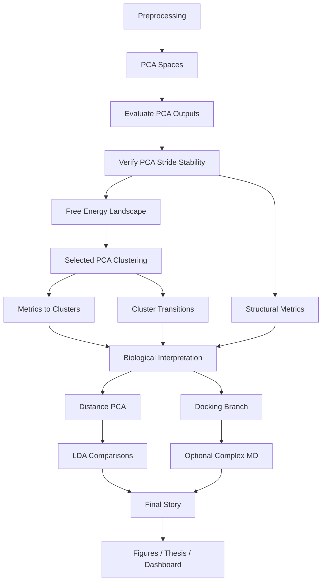

# ROS1 Pipeline Flowchart

## Purpose

Master roadmap for the ROS1 molecular dynamics analysis project.

---

## Step Order

1. `01_data_loading_preprocessing.py`
2. `02a_pca_actin_actout.py`
3. `02b_pca_ntl_ctl.py`
4. `02c_pca_aloop_ctlfit.py`
5. Evaluate PCA outputs
6. `02c_verify_pca_stride.py`
7. `03a_metrics_states.py`
8. `03c_free_energy_landscape.py`
9. `02e_map_metrics_to_clusters.py`
10. `02f_cluster_transitions.py`
11. `03b_distance_pca.py`
12. `04_lda_final_figures.py`
13. `04b_lda_pairwise_wt_vs_q2022p_family.py`
14. `04c_generalized_pairwise_lda.py`
15. Docking branch (Q2022P subset)

---

## Workflow Diagram

Replace your current Mermaid block inside ROS1_pipeline_flowchart.md with this updated version:

## PCA Selection Criteria

Choose PCA spaces showing:

- clear WT vs mutant separation
- replicate consistency
- meaningful basin structure
- interpretable motions
- useful explained variance

## Likely Candidates

- actout_ctlfit
- aloop

